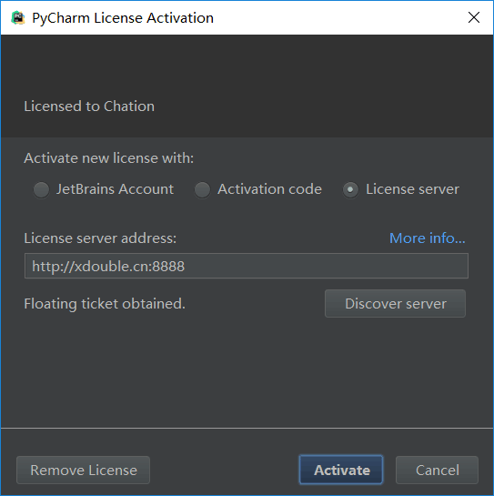

# FirstJavaWeb

第一个JavaWeb程序，对应的客户端请求代码地址：<https://github.com/fengqingxiuyi/NetworkComponent/tree/master/app/src/main/java/com/fqxyi/networkComponent/module/hello>

# IDE

[IntelliJ IDEA](https://download.jetbrains.8686c.com/idea/ideaIU-2018.1.6.exe)

破解码：http://xdouble.cn:8888/



# 参考文章

[Spring Boot快速入门](http://blog.didispace.com/spring-boot-learning-1/)

需要注意的是：

因为我Spring Boot的版本是2.0.3，所以在编写测试用例时，需要将下面代码

```
@RunWith(SpringJUnit4ClassRunner.class)
@SpringApplicationConfiguration(classes = MockServletContext.class)
@WebAppConfiguration
```

改为

```
@RunWith(SpringJUnit4ClassRunner.class)
@SpringBootTest(classes = MockServletContext.class)
```

# 使用方式

## 本地调用

~~请使用develop_local分支代码~~

## 远程调用

~~请使用develop_remote分支代码~~

# 部署到服务器

## 修改pom.xml

1、将`<packaging>jar</packaging>`改为`<packaging>war</packaging>`

2、将

```
<dependency>
    <groupId>org.springframework.boot</groupId>
    <artifactId>spring-boot-starter-web</artifactId>
</dependency>
```

改为

```
<dependency>
    <groupId>org.springframework.boot</groupId>
    <artifactId>spring-boot-starter-web</artifactId>
    <exclusions>
        <exclusion>
            <groupId>org.springframework.boot</groupId>
            <artifactId>spring-boot-starter-tomcat</artifactId>
        </exclusion>
    </exclusions>
</dependency>
```

3、添加tomcat依赖
  
```
<!-- tomcat -->
<dependency>
    <groupId>org.springframework.boot</groupId>
    <artifactId>spring-boot-starter-tomcat</artifactId>
    <scope>provided</scope>
</dependency>
```

4、添加插件

```
<plugin>
    <groupId>org.apache.maven.plugins</groupId>
    <artifactId>maven-war-plugin</artifactId>
</plugin>
```

## 修改Application类

将

```
@SpringBootApplication
public class FirstJavaWebApplication {

	public static void main(String[] args) {
		SpringApplication.run(FirstJavaWebApplication.class, args);
	}
}
```

改为

```
@ServletComponentScan
@SpringBootApplication
public class FirstJavaWebApplication extends SpringBootServletInitializer {

	@Override
	protected SpringApplicationBuilder configure(SpringApplicationBuilder builder) {
		return builder.sources(FirstJavaWebApplication.class);
	}

	public static void main(String[] args) {
		SpringApplication.run(FirstJavaWebApplication.class, args);
	}
}
```

## 使用`mvn package`生成war包

## 将war包放到服务器中tomcat安装目录下的webapps文件夹中，并重启tomcat即可访问

# web页面开发

参考文章：

1. [Using Thymeleaf](https://www.thymeleaf.org/doc/tutorials/3.0/usingthymeleaf.html)
2. [使用Spring Boot开发Web项目](https://blog.csdn.net/u012702547/article/details/53784992)